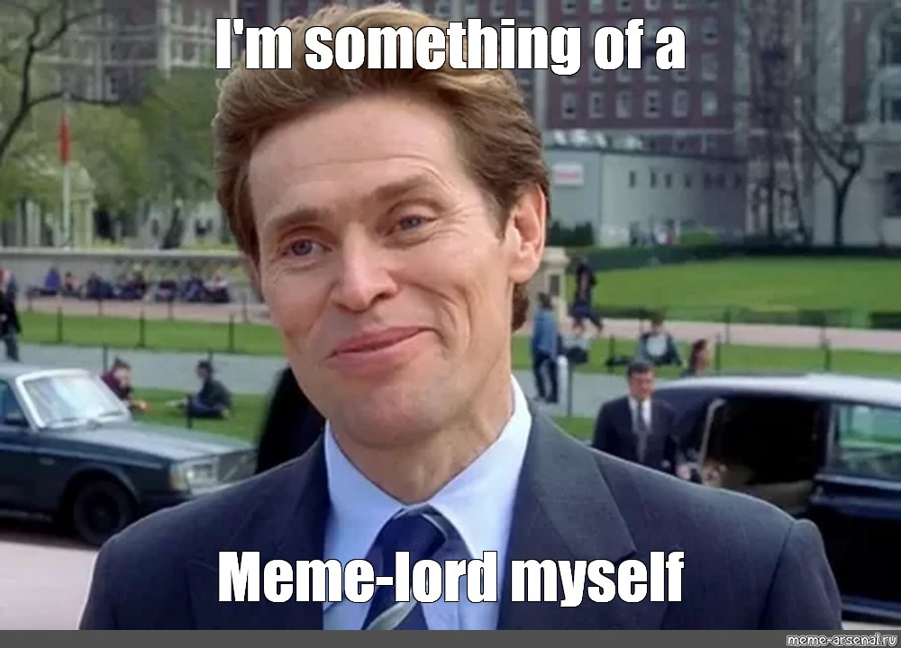

# Meme Lord



> Someone who has a vast quantity of quality memes ready for any situation.
> Usually the dankest of memes. A historian and curator of memes. Known to
> understand all levels of memes. A legendary hero who walks amongst the mere
> mortals of Earth.

## About

The goal of this project is to have a personal server/client setup where I
can post up dank memes.  The client will also support quickly searching through
them locally and provide a link to one in my clipboard to paste.

## Current Build

This project is currently in the alpha phase; but supports storing memes into
memory only.  The client work has not yet been started.  If you want to demo
the progress you can perform the following steps:

1. Build the project
   ```
   cargo build
   ```
2. Start the server
   ```
   ./target/debug/meme_lord_server
   ```
3. Upload a meme
   ```
   curl -F file=@assets/im-something-of-a-meme-lord-myself.jpg \
        -F details='{"meta":"spider man meme lord scientist"}' \
        localhost:8080/add
   ```
4. Verify it's in the manifest
   ```
   curl localhost:8080/.manifest
   ```
5. Verify the file is served back in the browser:
   ```
   http://localhost:8080/im-something-of-a-meme-lord-myself.jpg
   ```

## Next Steps ( In no particular order )

* Authentication for uploads
* Server configuration file
* File storage support instead of just memory
* Client
    * user config
    * post files
    * update local manifest
    * search and generate urls to clipboard via terminal UI
